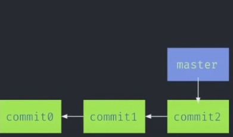
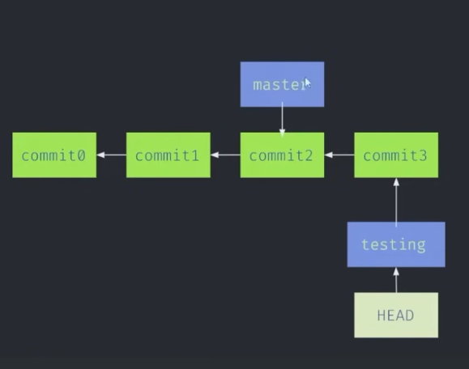

## Learning Git and GitHub through Satander Bootcamp

<h5>Git Stages</h5>


### First Commands to stage files and prepare for commit

```git
git init
git status
git add .\assets\ .\README.md

-- Show the modified lines
git diff
git diff --staged

-- Save the currrently stage of the repository
git commit -m "Adding README and assets"

-- History of commits
git log

-- Use of the command restore (Restore the file stage to the last commit)
git restore .\README.md 

-- Remove the file from staged area
git restore --staged .\README.md

-- Create a local main branch
git checkout -b main

--- After creating a repo remotely we have to add changes to github

-- Seeing if there's any differences between remote and local repos
git fetch https://github.com/Zosin0/git-commands-ada

-- Stage changes and save them
git add .
git commit -m "first commit"

-- Pushing local master changes
git push https://github.com/Zosin0/git-commands-ada.git master

-- Pull changes from remote branch main
git pull https://github.com/Zosin0/git-commands-ada.git origin main --allow-unrelated-histories

-- Uploading the default main remote branch
git push https://github.com/Zosin0/git-commands-ada.git main
``` 

### What's the difference between git and github?
#### Github - Creating Repos
>> Study
>> Work Projects
>> Portfolio - CV

### Learning about branches


```git
-- Creating a new branch 'testing'
git branch testing

-- Show where HEAD is
git log --oneline --decorate

-- Change the HEAD for branch testing
git checkout testing
```



