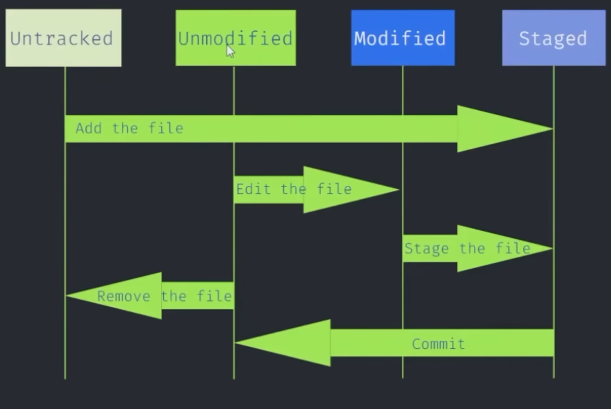

## Learning Git and GitHub through Satander Bootcamp

<h5>Git Stages</h5>

### First Commands to stage files and prepare for commit

´´´git
git init
git status
git add .\assets\ .\README.md

-- Show the modified lines
git diff
git diff --staged

-- Save the currrently stage of the repository
git commit -m "Adding README and assets"

-- History of commits
git log

-- Use of the command restore (Restore the file stage to the last commit)
git restore .\README.md 

-- Remove the file from staged area
git restore --staged .\README.md

-- Uploading changes to github
git push origin master

´´´

